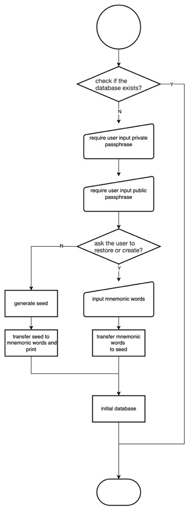
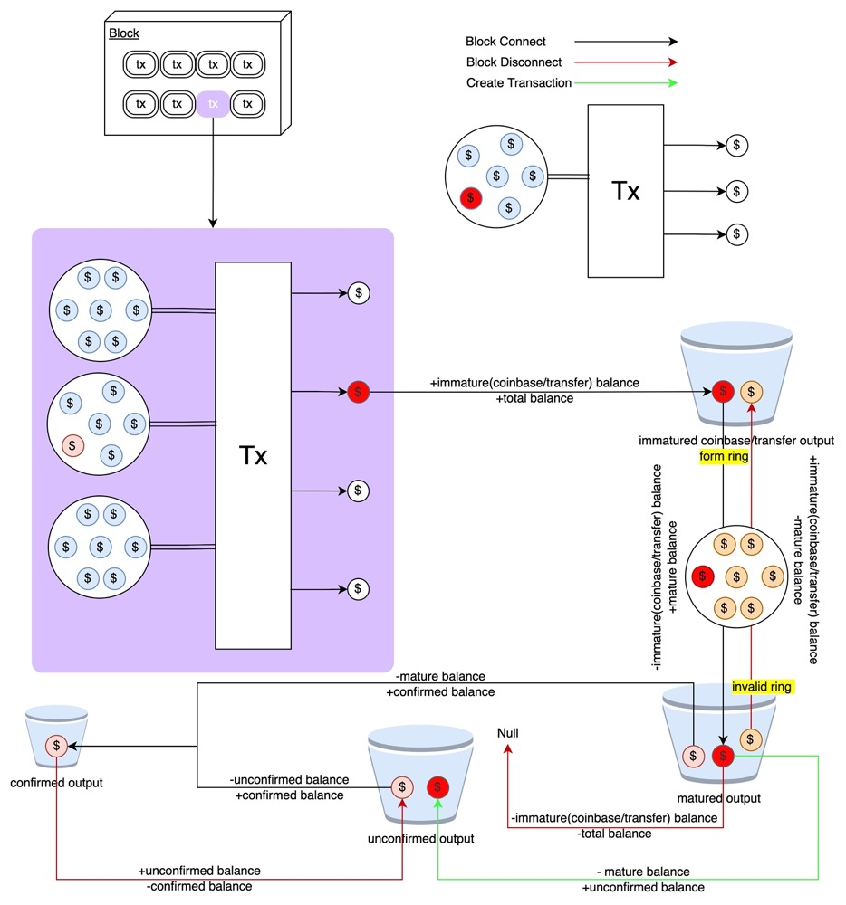
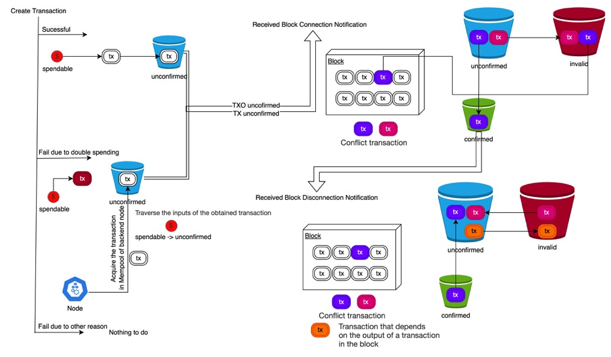
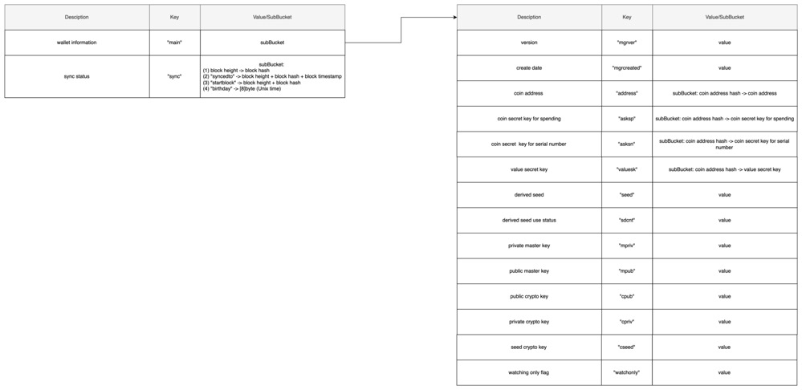
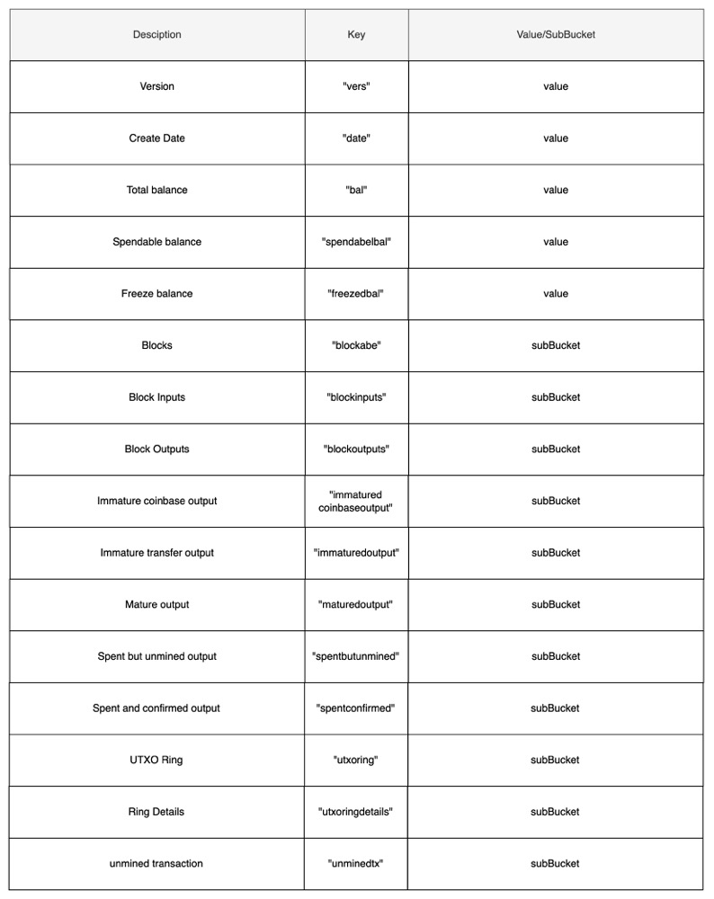

# 1. Overview

The main purpose of Abewallet is to manage the coin in Abelian blockchain. The main functions are as follows:

- Create new wallet
- Create and manage addresses
- Query the balances or other information of wallet
- Create and manage transactions
- Restore created wallet with mnemonic words

The architecture is as follows:

Through the interaction with the Abelian blockchain node (ABEC node), query and scan the block data, store the chain data concerned by the wallet through the database, at the same time, the wallet manages the address, and provides the function of creating transaction, and updates the wallet according to the updated data on the chain.


# 2. Functionalities (User Interface)
Abewallet provides the following functionalities to the users:
1. A user can create his wallet, and a 24-words mnemonic and an initial (first) address will be returned.
   Note that mnemonic words can be used to recover the wallet.
2. The wallet owner can create addresses when needed, by running his wallet and using the provided APIs.
3. Users can use the addresses to receive coins, in mining or transfer.
4. The wallet owner can configure his wallet to connect to a local or remote ABEC node.
5. The wallet owner can run the wallet to synchronize the blockchain data when needed, and the wallet will communicate with the connected (running) ABEC node, scan the blockchain and update its local database.
6. Users can query wallet status and information through the provided APIs.
7. When needed, a user can restore his wallet, by using the 24-words mnemonic. 

## 2.1 Create a new wallet

## 2.2 Create more addresses

## 2.3 Configure the connected ABEC node

## 2.4 Synchronize the blockchain

## 2.5 Query wallet status and blockchain information

## 2.6 Create Transfer Transactions

## 2.7 Restore a wallet


# 3. Detailed Designs

## 3.1 The start of abewallet
The ***package abewallet (actually abewallet/abewallet.go)*** is the entrance of the wallet.
- It loads configuration and parse command line, and if the configuration file does not exist, it will initialize that.
- The command and options to start abewallet are list as the table below: (TODO)
  - abewallet --create
    - start wallet create procedure
  - abewallet --walletpass=[public passphrase]
    - connect the ABEC node to synchronize the blockchain data
    - start the RPC server to listen the client's requests
  - ...
  
## 3.2 Wallet Create and Address Create
The command ***abewallet --create*** will trigger the procedure of wallet create.
If the wallet database exits, it will just show the warning information and stop.
Otherwise, it will 
- request the user to input ***private passphrase*** and ***public passphrase***
- request the user to input whether he has a seed to restore the wallet. To create a new wallet, here the user should input 'No'
- generate the ***seed***, the ***initial instance address***, and protect the wallet data using the private passphrase and public passphrase.

The designs are shown as below:
-- todo
-- the package is introduced when used

After a wallet is created, the wallet owner can create more addresses managed by this wallet, when needed:
- unlock the wallet using the private passphrase
- create a new address

## 3.3 Configure the connected ABEC node
ToDo: draw a picture, to show the connection architecture of ABEC node -- Wallet -- AbewalletCtl/RPCClient

## 3.4 Synchronize the blockchain
ToDo: describe the design here
-- the connection design
-- the data structure and data flow


# Process of the system

- Instructions for the overall use of the system

  1. Users can create wallets when needed. For each wallet, a 24-words mnemonic and an initial (first) address will be returned. 
  Note that mnemonic words can be used to recover the wallet.
  2. Users can create addresses when needed, by running his wallet and using the provided APIs.
  3. Users can use the addresses to receive coins, in mining or transfer.
  4. Users can configure the wallet to connect to a local or remote ABEC node. 
  5. Users can run the wallet when needed, and the wallet will communicate with the connected (running) ABEC node, scan the blockchain and update its local database.
  6. Users can query wallet status and information through the provided APIs.

- Create a new wallet

  

- Wallet status and query

  The wallet status includes the address and derivative status associated with the wallet, the wallet balance, the TXO set associated with the wallet and its status, the transaction related to the wallet and its status.

  - Wallet maintains a derived state and derives a new address according to the derived state

  - Wallet maintenance balance information, support query

  - The wallet maintains the wallet-related TXO set, which divides the TXO into five categories and supports querying different status TXO set.

    - Immature coinbase txo set
    - immature transfer txo set
    - mature txo set
    - unconfirmed txo set
    - confirmed txo set

    Balance information and TXO status flow are shown in the following figure, more details can be found below.：

    

  - Wallet maintains wallet-related transactions. Transactions are divided into three categories. Inquiry transactions will be supported later.

    - unconfirmed
    - confirmed
    - invalid

    The transaction status flow is shown in the following figure, more details can be found below.：

    - When creating a transaction, 
    - When receiving a block connection notification,
    - When receiving a block disconnection notification,
    
    
    
    

# Detail Information

## Abewallet

Responsible for parsing configuration files, creating new wallets or loading existing wallets, opening HTTP services, etc.

- Supported APIs

  | Name                   | Paramters                         | Description                                                  |
  | ---------------------- | --------------------------------- | ------------------------------------------------------------ |
  | getbalancesabe         | null                              | get the balance information of wallet                        |
  | getbestblockhash       | null                              | get the best synced block hash information                   |
  | help                   | null                              | print the help information                                   |
  | listallutxoabe         | null                              | print all txos which belong wallet                           |
  | listunmaturedabe       | null                              | print all immature txos which belong wallet                  |
  | listunspentabe         | null                              | print all mature txos which belong wallet                    |
  | listspendbutunminedabe | null                              | print all unconfirmed txos which belong wallet               |
  | listspentandminedabe   | null                              | print all confirmed txos which belong wallet                 |
  | sendtoaddressesabe     | [<br />address<br />amount<br />] | create a transction with assigned pairs of address and amount |
  | generateaddressabe     | null                              | derive a new address                                         |
  | walletpassphrase       | passphrase<br />timeout           | keep the wallet unlocked for a specified time                |

### chain

Multi-type node support is provided through the interface, which is responsible for the interface requirements for the interaction between the client and the whole node. Currently, only "abec" (the Golang implementation of abelian) is supported as a backend.

There are mainly two ways of interaction, one is in the form of function calls, and the other is asynchronous notification.

- Function calls include: getting data and sending transactions
- Asynchronous notifications include successful client connection, block connection to the main chain (block connection notification), and block separation from the main chain (block disconnection notification)

```go
type Interface interface {
   Start() error
   Stop()
   WaitForShutdown()
   GetBestBlock() (*chainhash.Hash, int32, error)               // request the best block height and hash
   GetBlockAbe(hash *chainhash.Hash) (*wire.MsgBlockAbe, error) // request the origin block by given hash
   GetBlockHash(int64) (*chainhash.Hash, error)                 //request the hash given height
   GetBlockHeader(*chainhash.Hash) (*wire.BlockHeader, error)   // request the block height given hash
   IsCurrent() bool
   BlockStamp() (*waddrmgr.BlockStamp, error)
   SendRawTransactionAbe(*wire.MsgTxAbe, bool) (*chainhash.Hash, error)
   RescanAbe(*chainhash.Hash) error
   NotifyBlocks() error
   Notifications() <-chan interface{} // receive the notification from block chain
   BackEnd() string
}
```

### cmd

Wallet-related tools, such as knowing part of the data, will be supported later.

### internal

##### cfgutil

Provide related auxiliary functions for parsing and loading configuration files, such as strings, currency conversion, check files, address translation, and so on.

##### prompt

Encapsulation function to receive user input in a secure manner

##### rpchelp

generate help information for Remote Process Call

##### zero

Force some private information to be emptied instead of waiting for GC to reclaim

### nat

Use UPnP to provide NAT function [will be integrated later]

### netparams

Set network parameters, including current network parameters, RPC server port, RPC client port

### rpc

Provide services through gRPC agreement [will be supported later]

### snacl

Provide key derivation function, use secretbox to implement encryption and decryption through XSalsa20 and Poly1305, use scrypt to provide key derivation function, and use secretbox to implement encryption and decryption through XSalsa20 and Poly1305.

### waddrmgr

Manage the address with the help of the database, provide the function of address derivation, and maintain the state of address derivation.

- Key management

  

- Address derivation and Derivation Status

  

- Address management

  


### wallet

The core module of abewallet. In this module, using a loader for responsibility to create open wallets and providing some callback methods to automatically call these when the wallet is opened. 

The txCreator is launched as a goroutine to receive instructions to create a deal.

The walletLocker is launched as a goroutine to receive instructions to unlock the wallet.

Moreover, the main logic for hanlding the notification as follow:

The logic of managing UTXO:

- When receiving a block connection notification, do the following process:
  - traverse all the output. If it belongs to you, record it and put it in two buckets (immature coinbase and immature transfer).
    - generate block output records for quick rollback
    - Update immature balance and total balance
  -  deal with all input and generate block input records for quick rollback
  - move matured output/unconfirmed output-> confirmed output
    - update mature balance, unconfirmed balance and total balance
    - update UTXORing
  - process coinbase maturity, check immatured coinbase data, and update immature coinbase balances and mature balances
  - check whether the current height is a special height, and if so, generate a ring.
    - update and record RingDetail and UTXORing for relevant transaction output
    - update immature transfer balances, mature balances
  - storing block and balance
- When receiving a block disconnection notification, do the following process:
  - check whether the current height is a special height, and if so, pull out the blockoutput of the three blocks that generate the ring.
    - for the corresponding things in mature/unconfirmed/confirmed transaction output, modify their RingHash to zero, and move to immatured transfer output respectively
    - for the only modified utxo.RingHash in immatured coinbase, put it back to immature coinbase output
    - update immature/mature/unconfirm/total balance
    - delete Ring and UTXORing
  - fetch the block output record, and delete them from immature trasfer/coinbase output, meanwhile update immature/total balance
  - fetch the block input record, update/delete UTXORing, and compare new and old UTXORing
    - put the corresponding UTXO of the serial number back into the mature output, then update mature/total balance
  - change the coinbase of the corresponding block to immature coinbase, and update the freezed/spendable balance

The logic of managing transaction:

- When creating a transaction, if the transaction is sucessful ,the record it as unconfirmed. Otherwise, if the transaction is rejected due to doule spending, so the conflicted transaction would be queried and record.
- When receiving a block connection notification,
  - check UTXORing, update UTXORing if it is related to wallet, and execute following processes
    - [TXO] compare UTXORing's wallet-related SerialNumbers and the Serial Numbers consumed in the transaction, indicating that the TXO in the wallet is related. Then change the corresponding TXO status to confirmed
    - [Tx] if there is no record of trading Tx in the wallet, put it in the wallet and record the status as confirmed. If the transaction Tx is in the wallet, regardless of whether the status is uncofirmed or invalid, modify their status to confirmed.
    - [Relevant Txs] the Unconfirmed Transactions mapped to according to the relevant TXO above. Indicates that the transaction is dependent on the TXO and changes its status to invalid
- When receiving a block disconnection notification,
  - check UTXORing, if it is related to wallet, roll back UTXORing, and execute following processes
    - [TXO Inputs] compare UTXORing's wallet-related SerialNumbers and the Serial Numbers consumed in the transaction, indicating that the TXO in the wallet is related. Then change the corresponding TXO status to unconfirmed
    - [Tx] the Tx record with transaction status of confirmed is modified to status unconfirmed
    - [Relevant Txs] the Invalid Transactions mapped to according to the relevant TXO above. Check whether the relevant UTXORing is valid, indicating that it is a transaction that depends on the TXO, and change its status to unconfirmed
    - [TXO Outputs] TXO in the block will become immature or deleted, and the relevant UTXORing will be updated. Transactions that reference these UTXORing's unconfirmed become invalid.

### walletdb

Database interface definition and implementation, using boltDB to manage wallet database, mainly includes the following parts:

- Provide creation and deletion of bucket
- Provide read and write transactions
- Provide traversal iterator of bucket
- Define and implement DB interface
- Provide DB registration

### wordlists

Quote BIP-0039 's mnemonic list as a wallet mnemonic list

### wtxmgr

Walletdb provides storage capabilities for wallet tracking UTXO-related data, including, but not limited to, Raw UTXO data and auxiliary data, as well as automated processes for data management.

The database storage design is as follows：

- Data and state management storage:
  


