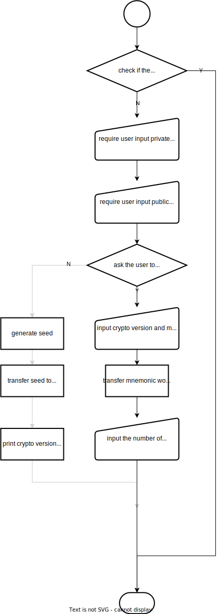
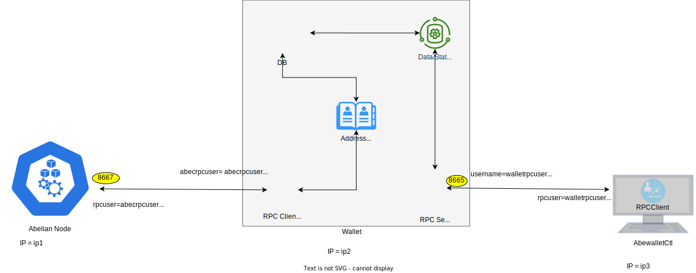
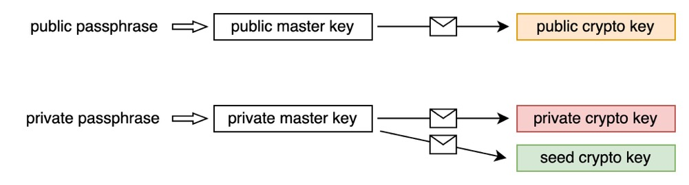

# 1. Overview

The main purpose of Abewallet is to manage the Transaction Output (also known as **TXO** or **coin**) of the wallet owner.

The main functions are as follows:

- Create new wallet
- Create and manage addresses
- Query the balances or other information of wallet
- Create and manage transactions
- Restore wallet with mnemonic words

The architecture is as follows:


- Through the connection and interaction with the Abelian blockchain node (referred to as **ABEC node**), the wallet can query and scan the data in blockchain.
- The wallet owner's coins and corresponding keys, as well as related data (e.g., transactions) are stored in wallet database.
- In addition, wallet manages the address, and provides the function of creating transaction.

In words, wallet obtains data from blockchain, store only the data related to its owner, and produce (transfer) transactions for the Abelian system.

# 2. Functionalities (User Interface)
Abewallet provides the following functionalities to the users:
1. A user can create his/her wallet, and a 24-words mnemonic and an initial (first) address will be returned.
   **Note that mnemonic words can be used to restore the wallet.**
2. The wallet owner can configure his wallet to connect to a local or remote ABEC node.
3. The wallet owner can create addresses when needed, by running his wallet and using the provided APIs.
4. Users can use the addresses created by wallet to receive coins, in mining or transfer.
5. The wallet owner can run the wallet to synchronize the blockchain data when needed, and the wallet will communicate with the connected (running) ABEC node, scan the blockchain and update its local database.
6. Users can query wallet status and information through the provided APIs.
7. When needed, a user can restore his/her wallet, by using the crypto version and  the 24-words mnemonic. 

## 2.1 Create a new wallet
A user can create a wallet by command `./abewallet --create`. 
In this process, the program would check whether the data directory exists, and exit if so, otherwise enter the process of creating a wallet, the overall process is shown in the figure.


- require the user to enter a **private passphrase** and a **public passphrase**. 
- output **crypto version** and **mnemonic words** and remind users to store them in a safe place.
- create the wallet and output an initial (first) address.
- exit.

## 2.2 Configure and run a wallet 
The command `abewallet --create` will exit after creating a wallet. 
To run and use the wallet, the user need to make a minimal configuration in **abewallet.conf**.
mamely, (1) configure the **rpcuser** and **rpcpass**, which enable wallet to be accessed by RPC connection,
and (2) configure a local or remote ABEC node, which will enable a wallet to synchronize data from blockchain.

The configuration items for connecting ABEC node include:

- `abecrpcuser=[abec node rpc username]`

  `abecrpcuser` should be configured to be the value of  `rpcuser` in abec.conf of abelian node side.

-  `abecrpcpass=[abec node rpc password]`

  `abecrpcpass` should be configured to be the value of  `rpcpass` in abec.conf of abelian node side.

- `rpcconnect=[abec node ip,default localhost]`

  `rpcconnect` should be configured to be the value of `rpclisten` in abec.conf of abelian node.

- `cafile=[/path/to/xxx.cert,default /path/to/.abec/rpc.cert]`

  `cafile` should be certificate file of rpc server of the ABEC node.

After the configuration, a user can start the wallet by the command 

`abewallet --walletpass=[public passphrase] `

**NOTE:** At this moment, we provide only online-wallet, i.e., the users must configure a local or remote ABEC node, 
and when the wallet is started, it will connect the configured ABEC node and catch up the blockchain and stay sychronized.
Later, we may provide offline wallet.

## 2.3 Create more addresses

When a wallet is running, the wallet owner can run the following two commands to generate a new address:
- unlock the wallet with private passphrase 

  `abewalletctl --rpcuser=[rpc username] --rpcpass=[rpc password] --wallet walletpassphrase [private passphrase] [timeout]` 

  **NOTE: *timeout* is in seconds.**

- generate a new address 

  `abewalletctl --rpcuser=[rpc username] --rpcpass=[rpc password] --wallet generateaddressabe `

  An **instance address** and its **index number** will be returned.

**NOTE:** We use the term `instance Address` to denote the addresses that users use to receive coins in mining or transfer.


## 2.4 Synchronize the blockchain
Suppose the configuration items for connecting ABEC node are configured.

When the wallet is started using the following command with **public passphrase**, 
the wallet will establish a connection with the configured ABEC node, and synchronize the data from the node and fetch the coins belonging to the wallet.

`abewallet --walletpass=[public passphrase] `

## 2.5 Query wallet status and blockchain information

Wallet provides the following APIs for querying wallet status and blockchain information:

| Name                   | Paramters               | Description                                     |
| ---------------------- | ----------------------- |-------------------------------------------------|
| getbalancesabe         | null                    | get the balance information of the wallet onwer |
| getbestblockhash       | null                    | get the best synced block hash information      |
| help                   | null                    | print the help information                      |
| listallutxoabe         | null                    | print all txos which belong wallet              |
| listunmaturedabe       | null                    | print all immature txos which belong wallet     |
| listunspentabe         | null                    | print all mature txos which belong wallet       |
| listspendbutunminedabe | null                    | print all unconfirmed txos which belong wallet  |
| listspentandminedabe   | null                    | print all confirmed txos which belong wallet    |
| generateaddressabe     | null                    | derive a new address                            |
| walletpassphrase       | passphrase<br />timeout | keep the wallet unlocked for a specified time   |

## 2.6 Create Transfer Transactions
When a wallet is running, the wallet owner can unlock the wallet using private passphrase and then use the following API to create a transfer transaction, which is automatically sent to the connected ABEC node, and then is broadcast to Abelian network.

**Note: during the transaction generation, a new address may be generated to store change. When the transaction is created successfully, the *max index number* of address in the wallet would be returned.**

| Name               | Paramaters                        | Description                                                  |
| ------------------ | --------------------------------- | ------------------------------------------------------------ |
| sendtoaddressesabe | [<br />address<br />amount<br />] | create a transction with assigned pairs of address and amount |

## 2.7 Restore a wallet

A user can recover his/her wallet through the mnemonic words saved when generating the wallet. 
The process is basically the same as creating a wallet, except that choose to `have seed` and then input the crypto version and mnemonic words (for seed). 

**Note that the user is also required to input the max index number of recovery addresses.** 

**During the process of generating addresses and creating transactions, the output will always show the current max index of address in wallet, and users shall notice this information.** 




# 3. Detailed Designs

## 3.1 The start of abewallet
The ***package abewallet (actually abewallet/abewallet.go)*** is the entrance of the wallet.
- It loads configuration and parse command line, and if the configuration file does not exist, it will initialize that.
- The command and options to start abewallet are list as the table below:
  - `abewallet --create`
    - start wallet create procedure
      - initial and fill the database
      - generate the initial (first) address
      - scan the genesis block
  - `abewallet --walletpass=[public passphrase]`
    - connect the ABEC node to synchronize the blockchain data
    - start the RPC server to listen the client's requests
  
## 3.2 Wallet Create and Address Create

#### 3.2.1 Wallet create

The command `abewallet --create` will trigger the procedure of wallet creation.
If the wallet database exits, it will just show the warning information and stop.
Otherwise, it will 

- request the user to input ***private passphrase*** and ***public passphrase***. 

- request the user to input whether he has a seed to restore the wallet. To create a new wallet, here the user should input 'No'.

- generate the ***seed***, then convert the seed to **mnemonic words** with the wordlists defiend in package `wordlists`.

- create buckets relevant to address and transaction. More details would be described below【 TODO reference】.

- create the protecting key as shown in the following figure:

  

  - Three crypto keys are generated randomly with the help of package `snacl` i.e. **public crypto key**, **private crypto key** and **seed crypto key**, which will be used to protect the wallet data.

  - A **public master key** is generated from public passphrase, and is used to protect the public crypto key.

  - A **private master key** is generated from private passphrase, and is used to protect the private crypto key and **seed crypto key**.

- derive the seeds as shown in the following figure:

  

  - A **address key seed** and a **value key seed** are generated from the **seed**.

    The seed will be wiped while these two derived seeds will be stored in the wallet for address generation. 

- intialize the **index number** of address to be 0.

- generate the initial (first) instance address according to the following process of address generation.

#### 3.2.2 Address generate

To generate an **instance address**, the **instance seed** is firstly generated from the two derived seed and index number. More specifically, the instance seed consists of  two parts, the first part is generated from (the address key, the index number) , and the second part is generated from (the value key seed, the index number). Then, the instance seed is used to call the package `abec/abecrypto`, and an instance address and its keys are returned. The keys includes **crypto address spend key**, **crypto address serial number key**, and **crypto view key**. The index number will be incremented by 1.

- **instance address** is used as receiving address such as as mining address or a receiving address for transfer transactions.
- **crypto address spend key** is used to transfer money, the key would be require when generating the transaction.
- **crypto address serial number key** is used to generate an unique identification for each transaction ouptut in abelian blockchain.
- **crypto view key** is used to view the currency information in the transaction output.

NOTE: the address key seed and the value key seed is protected by the seed crypto key; the instance addres, the crypto address serial number key, and the crypto view key are protected by public crypto key; and the crypto address spend key is protected  by private crypto key. 

## 3.3 Configure the connected ABEC node

Overview of connection architecture :



- At the node side, port 8667 as the default port is used to listen for connections and requests, at the same time,  `rpcuser`, `rpcpass`  and certificates is used to  provide identity authentication capabilities.

- At the wallet side, port 8665 as the default port is used to listen for connections and requests, at the same time,  `username`, `password`  and certificates is used to  provide identity authentication capabilities. At the same time,  the wallet establishes a connection with the node by specifying `abecrpcuser` and `abecrpcpass`, IP address of abelian node, and its certificate.

​	NOTE: 

- If `abecrpcuser` and `abecrpcpass` are not specified, the `username` and  `password` are used instead.【TODO discard the bind, rename abecrpcuser/abecrpcpass to abecrpcuser/abecrpcpass, username/password to rpcuser/rpcpass 】

- If the wallet runs in the same machine, the `cafile` and `rpcconnect` don't need to be set.

At the abewalletctl side, the command terminal establishes a connection with the wallet by specifying `rpcuser`, `rpcpass` , IP address of wallet, and its certificate.

NOTE: 

- If the abewalletctl runs in the same machine, the `rpccert` and `rpcserver` don't need to be set.

## 3.4 Synchronize the blockchain

By scanning the blockchain data, the wallet checks and stores the transaction outputs (also known as  **TXO**s or **coin**s). According to the characteristics of the blockchain, it can be divided into two basic processes, one is that a block is connected to the block chain, and the other is that the block is disconnected from the block chain. Both cases can be realized through the notification mechanism of the node. 

The database of wallet is design as follow:

The wallet status includes the address and derivative status associated with the wallet, the wallet balance, the TXO set associated with the wallet and its status, the transaction related to the wallet and its status.

- Wallet maintains a index number and derives a new address according to the indexer number
- Wallet maintains balance information to support query
- The wallet maintains the wallet-related TXO set, which divides the TXO into five categories and supports querying different status TXO set.

  - Immature coinbase txo set
  - immature transfer txo set
  - mature txo set
  - unconfirmed txo set
  - confirmed txo set

In the wallet, the processing logic for the block chain transaction output is as follows:


- When receiving a block connection notification, do the following process:
  - traverse all the output. If it belongs to you, record it and put it in two buckets (immature coinbase and immature transfer).
    - generate block output records for quick rollback
    - Update immature balance and total balance
  - deal with all input and generate block input records for quick rollback
  - move matured output/unconfirmed output-> confirmed output
    - update mature balance, unconfirmed balance and total balance
    - update UTXORing
  - process coinbase maturity, check immatured coinbase data, and update immature coinbase balances and mature balances
  - check whether the current height is a special height, and if so, generate a ring.
    - update and record RingDetail and UTXORing for relevant transaction output
    - update immature transfer balances, mature balances
  - storing block and balance
- When receiving a block disconnection notification, do the following process:
  - check whether the current height is a special height, and if so, pull out the blockoutput of the three blocks that generate the ring.
    - for the corresponding things in mature/unconfirmed/confirmed transaction output, modify their RingHash to zero, and move to immatured transfer output respectively
    - for the only modified utxo.RingHash in immatured coinbase, put it back to immature coinbase output
    - update immature/mature/unconfirm/total balance
    - delete Ring and UTXORing
  - fetch the block output record, and delete them from immature trasfer/coinbase output, meanwhile update immature/total balance
  - fetch the block input record, update/delete UTXORing, and compare new and old UTXORing
    - put the corresponding UTXO of the serial number back into the mature output, then update mature/total balance
  - change the coinbase of the corresponding block to immature coinbase, and update the freezed/spendable balance

## 3.5 Query wallet information

To support querying wallet information, the wallet provides external service through RPC Server, the default port is 8667.

All services are provided by registering the command name and the corresponding handler in package `rpc/legacyrpc`.

| Name                   | Paramters               | Description                                                  |
| ---------------------- | ----------------------- | ------------------------------------------------------------ |
| getbalancesabe         | null                    | get the balance information of wallet by directly querying the database |
| getbestblockhash       | null                    | get the best synced block hash information by directly querying the database |
| help                   | null                    | print the help information                                   |
| listallutxoabe         | null                    | print all txos which belong wallet by directly querying some sub-bucket in database |
| listunmaturedabe       | null                    | print all immature txos which belong wallet by directly querying the sub-bucket in database |
| listunspentabe         | null                    | print all mature txos which belong wallet by directly querying the sub-bucket in database |
| listspendbutunminedabe | null                    | print all unconfirmed txos which belong wallet by directly querying the sub-bucket in database |
| listspentandminedabe   | null                    | print all confirmed txos which belong wallet by directly querying the sub-bucket in database |
| generateaddressabe     | null                    | derive a new address by derived seed and index number which increase by 1 after completion |
| walletpassphrase       | passphrase<br />timeout | keep the wallet unlocked for a specified time                |

## 3.6 Transfe Transaction Create

Wallet maintains wallet-related transactions. Transactions are divided into three categories. Inquiry transactions will be supported later.

- unconfirmed
- confirmed
- invalid

The transaction status flow is shown in the following figure, more details can be found below.：

- When creating a transaction, 
- When receiving a block connection notification,
- When receiving a block disconnection notification,


The logic of managing transaction:

- When creating a transaction, if the transaction is sucessful ,the record it as unconfirmed. Otherwise, if the transaction is rejected due to doule spending, so the conflicted transaction would be queried and record.
- When receiving a block connection notification,
  - check UTXORing, update UTXORing if it is related to wallet, and execute following processes
    - [TXO] compare UTXORing's wallet-related SerialNumbers and the Serial Numbers consumed in the transaction, indicating that the TXO in the wallet is related. Then change the corresponding TXO status to confirmed
    - [Tx] if there is no record of trading Tx in the wallet, put it in the wallet and record the status as confirmed. If the transaction Tx is in the wallet, regardless of whether the status is uncofirmed or invalid, modify their status to confirmed.
    - [Relevant Txs] the Unconfirmed Transactions mapped to according to the relevant TXO above. Indicates that the transaction is dependent on the TXO and changes its status to invalid
- When receiving a block disconnection notification,
  - check UTXORing, if it is related to wallet, roll back UTXORing, and execute following processes
    - [TXO Inputs] compare UTXORing's wallet-related SerialNumbers and the Serial Numbers consumed in the transaction, indicating that the TXO in the wallet is related. Then change the corresponding TXO status to unconfirmed
    - [Tx] the Tx record with transaction status of confirmed is modified to status unconfirmed
    - [Relevant Txs] the Invalid Transactions mapped to according to the relevant TXO above. Check whether the relevant UTXORing is valid, indicating that it is a transaction that depends on the TXO, and change its status to unconfirmed
    - [TXO Outputs] TXO in the block will become immature or deleted, and the relevant UTXORing will be updated. Transactions that reference these UTXORing's unconfirmed become invalid.

## 3.7 Restore Wallet

Users can recover their wallets through the mnemonic words saved when generating the wallet. The process is basically the same as creating a wallet. As shown in the following figure, the main difference is that the user converts active input mnemonic words into seeds rather than automatically created by the wallet and then into mnemonic words. Note that the user is required to input the **max index number** of recovery addresses.

The wallet initializes the database, converts the mnemonic words to the seed, and complete the process of seed derivation, and initialize index at the same time and generates addresses based on the maximum number of addresses entered, and  the genesis block will be scanned.

.svg)


# 4. Package and its dependence

An overview of package dependencies is shown in the following figure:


## Abewallet

Responsible for parsing configuration files, creating new wallets or loading existing wallets, opening HTTP services, etc.

- Supported APIs

  | Name                   | Paramters                         | Description                                                  |
  | ---------------------- | --------------------------------- | ------------------------------------------------------------ |
  | getbalancesabe         | null                              | get the balance information of wallet                        |
  | getbestblockhash       | null                              | get the best synced block hash information                   |
  | help                   | null                              | print the help information                                   |
  | listallutxoabe         | null                              | print all txos which belong wallet                           |
  | listunmaturedabe       | null                              | print all immature txos which belong wallet                  |
  | listunspentabe         | null                              | print all mature txos which belong wallet                    |
  | listspendbutunminedabe | null                              | print all unconfirmed txos which belong wallet               |
  | listspentandminedabe   | null                              | print all confirmed txos which belong wallet                 |
  | sendtoaddressesabe     | [<br />address<br />amount<br />] | create a transction with assigned pairs of address and amount |
  | generateaddressabe     | null                              | derive a new address                                         |
  | walletpassphrase       | passphrase<br />timeout           | keep the wallet unlocked for a specified time                |

### chain

Multi-type node support is provided through the interface, which is responsible for the interface requirements for the interaction between the client and the whole node. Currently, only "abec" (the Golang implementation of abelian) is supported as a backend.

There are mainly two ways of interaction, one is in the form of function calls, and the other is asynchronous notification.

- Function calls include: getting data and sending transactions
- Asynchronous notifications include successful client connection, block connection to the main chain (block connection notification), and block separation from the main chain (block disconnection notification)

```go
type Interface interface {
   Start() error
   Stop()
   WaitForShutdown()
   GetBestBlock() (*chainhash.Hash, int32, error)               // request the best block height and hash
   GetBlockAbe(hash *chainhash.Hash) (*wire.MsgBlockAbe, error) // request the origin block by given hash
   GetBlockHash(int64) (*chainhash.Hash, error)                 //request the hash given height
   GetBlockHeader(*chainhash.Hash) (*wire.BlockHeader, error)   // request the block height given hash
   IsCurrent() bool
   BlockStamp() (*waddrmgr.BlockStamp, error)
   SendRawTransactionAbe(*wire.MsgTxAbe, bool) (*chainhash.Hash, error)
   RescanAbe(*chainhash.Hash) error
   NotifyBlocks() error
   Notifications() <-chan interface{} // receive the notification from block chain
   BackEnd() string
}
```

### cmd

Wallet-related tools, such as knowing part of the data, will be supported later.

### internal

##### cfgutil

Provide related auxiliary functions for parsing and loading configuration files, such as strings, currency conversion, check files, address translation, and so on.

##### prompt

Encapsulation function to receive user input in a secure manner

##### rpchelp

generate help information for Remote Process Call

##### zero

Force some private information to be emptied instead of waiting for GC to reclaim

### nat

Use UPnP to provide NAT function [will be integrated later]

### netparams

Set network parameters, including current network parameters, RPC server port, RPC client port

### rpc

Provide services through gRPC agreement [will be supported later]

### snacl

Provide key derivation function, use secretbox to implement encryption and decryption through XSalsa20 and Poly1305, use scrypt to provide key derivation function, and use secretbox to implement encryption and decryption through XSalsa20 and Poly1305.

### waddrmgr

Manage the address with the help of the database, provide the function of address derivation, and maintain the state of address derivation.

- Key management

  

- Address derivation and Derivation Status

  

- Address management

  


### wallet

The core module of abewallet. In this module, using a loader for responsibility to create open wallets and providing some callback methods to automatically call these when the wallet is opened. 

The txCreator is launched as a goroutine to receive instructions to create a deal.

The walletLocker is launched as a goroutine to receive instructions to unlock the wallet.

### walletdb

Database interface definition and implementation, using boltDB to manage wallet database, mainly includes the following parts:

- Provide creation and deletion of bucket
- Provide read and write transactions
- Provide traversal iterator of bucket
- Define and implement DB interface
- Provide DB registration

### wordlists

Quote BIP-0039 's mnemonic list as a wallet mnemonic list

### wtxmgr

Walletdb provides storage capabilities for wallet tracking UTXO-related data, including, but not limited to, Raw UTXO data and auxiliary data, as well as automated processes for data management.

The database storage design is as follows：

- Data and state management storage:
  


