# 1. Overview

The main purpose of Abewallet is to manage the Transaction Output (also known as **TXO** or **coin**) of the wallet owner.

The main functions are as follows:

- Create new wallet
- Create and manage addresses
- Query the balances or other information of wallet
- Create and manage transactions
- Restore wallet with mnemonic words

The architecture is as follows:


- Through the connection and interaction with the Abelian blockchain node (referred to as **ABEC node**), the wallet can query and scan the data in blockchain.
- The wallet owner's coins and corresponding keys, as well as related data (e.g., transactions) are stored in wallet database.
- In addition, wallet manages the address, and provides the function of creating transaction.

In words, wallet obtains data from blockchain, store only the data related to its owner, and produce (transfer) transactions for the Abelian system.

# 2. Functionalities (User Interface)
Abewallet provides the following functionalities to the users:
1. A user can create his wallet, then a crypto version, a 24-words mnemonic, and an initial (first) address will be returned.
   **Note that the crypto version and mnemonic words can be used to restore the wallet.**
2. The wallet owner can configure his wallet to provide API services and connection to a local or remote ABEC node.
3. The wallet owner can create addresses when needed, by running his wallet and using the provided APIs.
4. Users can use the addresses created by wallet to receive coins, in mining or transfer.
5. The wallet owner can run the wallet to synchronize the blockchain data when needed, and the wallet will communicate with the connected (running) ABEC node, scan the blockchain and update its local database.
6. Users can query wallet status and information through the provided APIs.
7. When needed, a user can restore his/her wallet, by using the crypto version and  the 24-words mnemonic. 

## 2.1 Create a new wallet
A user can create a wallet by command `./abewallet --create`. 
In this process, the program would check whether the data directory exists, and exit if so, otherwise enter the process of creating a wallet, the overall process is shown in the figure.

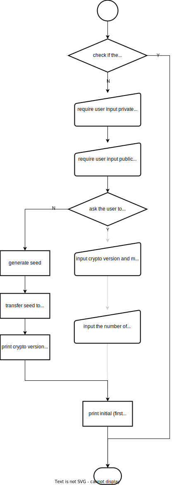

- require the user to enter a **private passphrase** and a **public passphrase**. 
- output **crypto version** and **mnemonic words** and remind users to store them in a safe place.
- create the wallet and output an initial (first) address.
- exit.

## 2.2 Configure and run a wallet 
The command `abewallet --create` will exit after creating a wallet. 
To run and use the wallet, the user need to make a minimal configuration in **abewallet.conf**,
namely, configure the **rpcuser** and **rpcpass**, which enable wallet to be accessed by RPC APIs.
In addition, if a local or remote ABEC node is configured as below, when the wallet is started, 
it will synchronize blockchain from the configured ABEC node.

The configuration items for connecting ABEC node include:

- `abecrpcuser=[abec node rpc username]`

  `abecrpcuser` should be configured to be the value of  `rpcuser` in abec.conf of abelian node side.

-  `abecrpcpass=[abec node rpc password]`

  `abecrpcpass` should be configured to be the value of  `rpcpass` in abec.conf of abelian node side.

- `rpcconnect=[abec node ip,default localhost]`

  `rpcconnect` should be configured to be the value of `rpclisten` in abec.conf of abelian node.

- `cafile=[/path/to/xxx.cert,default /path/to/.abec/rpc.cert]`

  `cafile` should be certificate file of rpc server of the ABEC node.

After the configuration, a user can start the wallet by the command 

`abewallet --walletpass=[public passphrase] `

**NOTE:** If the ABEC node is not configured, the running wallet will allow API accesses except creating transaction, 
but the returned results may be inaccurate, since they are based on the local database of wallet rather than the latest blockchain.
But the owner can make use of this offline feature to create addresses safely. 
In the future, we may provide creating transaction offline.

## 2.3 Create more addresses

When a wallet is running, the wallet owner can run the following two commands to generate a new address:
- unlock the wallet with private passphrase 

  `abewalletctl --rpcuser=[rpc username] --rpcpass=[rpc password] --wallet unlockwallet [private passphrase] [timeout]` 

  **NOTE: *timeout* is in seconds.**

- generate a new address 

  `abewalletctl --rpcuser=[rpc username] --rpcpass=[rpc password] --wallet generateaddressabe `

  An **instance address** and its **index number** will be returned.

**NOTE:** We use the term `instance Address` to denote the addresses that users use to receive coins in mining or transfer.


## 2.4 Synchronize the blockchain
Suppose the configuration items for connecting ABEC node are configured.

When the wallet is started using the following command with **public passphrase**, 
the wallet will establish a connection with the configured ABEC node, and synchronize the data from the node and fetch the coins belonging to the wallet.

`abewallet --walletpass=[public passphrase] `

## 2.5 Query wallet status and blockchain information

Wallet provides the following APIs for querying wallet status and blockchain information:

| Name              | Paramters               | Description                                     |
|-------------------| ----------------------- |-------------------------------------------------|
| getbalances       | null                    | get the balance information of the wallet onwer |
| getbestblockhash  | null                    | get the best synced block hash information      |
| help              | null                    | print the help information                      |
| listallutxo       | null                    | print all txos which belong wallet              |
| listimmaturetxo   | null                    | print all immature txos which belong wallet     |
| listspendabletxo  | null                    | print all mature txos which belong wallet       |
| listuncofirmedtxo | null                    | print all unconfirmed txos which belong wallet  |
| listspenttxo      | null                    | print all confirmed txos which belong wallet    |

## 2.6 Create Transfer Transactions
When a wallet is running, the owner can unlock the wallet using private passphrase and then use the following API to create a transfer transaction, which is automatically sent to the connected ABEC node, and then is broadcast to Abelian network.

**Note: during the transaction generation, a new address may be generated to store change. When the transaction is created successfully, the *max index number* of address in the wallet would be returned.**

| Name               | Paramaters                        | Description                                                  |
| ------------------ | --------------------------------- | ------------------------------------------------------------ |
| sendtoaddressesabe | [<br />address<br />amount<br />] | create a transction with assigned pairs of address and amount |

## 2.7 Restore a wallet

A user can recover/restore his wallet through the crypto version and mnemonic words saved when generating the wallet. 
The process is basically the same as creating a wallet, except that choose to **have existing seed** and then input the crypto version and mnemonic words (for seed). 

**Note that the user is also required to input the max index number of addresses to recovered.** 

**During the process of generating addresses and creating transactions, the output will always show the current max index of address in wallet, and users shall notice this information.** 

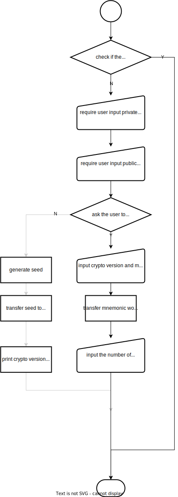


# 3. Detailed Designs

## 3.1 Wallet Create and Address Generate

### 3.2.1 Wallet Create

The command `abewallet --create` will trigger the procedure of wallet creation.
If the wallet database exits, it will just show the warning information and stop.
Otherwise, it will 

- request the user to input **private passphrase** and **public passphrase**. 

- request the user to input whether he has a seed to restore the wallet. To create a new wallet, here the user should input 'No'.

- generate the **seed**, then convert the seed to **mnemonic words** with the word lists defined in package `abeallet/wordlists`.

- create `buckets` relevant to address and transaction. More details would be described below in 3.?.?【 TODO reference】.
  
  **NOTE:** we are using `BoltDB` as the underlying database, where buckets are used to store the data in the form of (name, value) pair.

- create the protecting keys as shown in the following figure:

  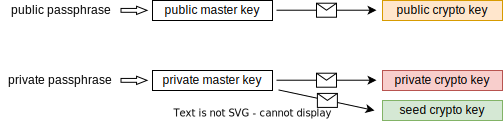

  - Three crypto keys are generated randomly with the help of package `abewallet.snacl` i.e. **public crypto key**, **private crypto key** and **seed crypto key**, 
  which will be used to protect/encrypt the wallet data.

  - A **public master key** is generated from public passphrase, and is used to protect the public crypto key.

  - A **private master key** is generated from private passphrase, and is used to protect the private crypto key and seed crypto key.

- derive the seeds as shown in the following figure:

  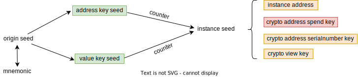

  - A **address key seed** and a **value key seed** are generated from the **seed**.

    The seed will be wiped while these two derived seeds will be stored in the wallet for address generation. 

- initialize the **index number** of address to be 0.

- generate the initial (first) instance address according to the following process of address generation.

### 3.2.2 Address Generate

To generate an **instance address**, an **instance seed** is firstly generated from the two derived seeds and the current index number. 
More specifically, the instance seed consists of two parts, where the first part is generated from (the address key, the index number) and the second part is generated from (the value key seed, the index number). 
Then, the instance seed is used to call the package `abec/abecrypto`, and an instance address and its keys are returned. 
The keys include **crypto address spend key**, **crypto address serial number key**, and **crypto view key**. The index number will be incremented by 1.

- **instance address** is used as the mining address in mining or receiving address in transfer transactions.
- **crypto address spend key** is used to transfer coins, which is used to unlock the wallet before creating transfer transactions.
- **crypto address serial number key** is used to generate a unique identifier for each TXO in Abelian blockchain.
- **crypto view key** is used to view the currency information in the transaction output. 

NOTE: the address key seed and the value key seed is protected by the seed crypto key;
the crypto address spend key is protected  by private crypto key;
the instance address, the crypto address serial number key and the crypto view key are protected by public crypto key.


## 3.3 Configure the Wallet

The overview of the connection between wallet and ABEC node, 
as well as the services to users is shown as the following figure.

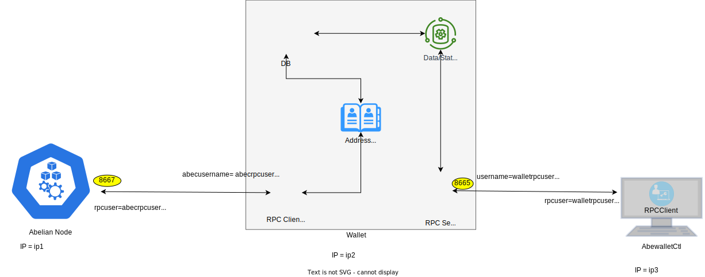

- At the ABEC node side, port 8667 is used as the default port to listen for connections and requests.
  At the same time,  `rpcuser`, `rpcpass`  and certificates are used to  provide identity authentication capabilities.

- At the wallet side, to connect a local or remote ABEC node, `abecrpcuser`, `abecrpcpass`, `abecrpcconnect` (for IP address and port (default 8667) of ABEC node), and `abeccafile` (for certificate of ABEC node) need to be configured.
  On the other side, to provide services to users, wallet must make a minimum configure to configure `rpcuser` and `rpcpass`, which will be used to access the services of wallet.
  The port 8665 is used as the default port to listen for connections and requests to wallet.

- At the user side, the owner can access the wallet service by using `rpcuser`, `rpcpass`, `rpcserver` (for IP address and port (default 8665) of wallet), and `rpccert`. For example, by **abewalletctl** or **http/websocket**  connection.

**NOTE:** 
- If the wallet runs in the same machine with the ABEC node, the `abeccafile` and `abecrpcconnect` don't need to be configured.

- If the abewalletctl runs in the same machine with the wallet, the `rpccert` and `rpcserver` don't need to be set.

## 3.4 Synchronize the blockchain

For a wallet configured to connect a ABEC node, when it is started, it will 
establish a connection with the configured ABEC node, 
synchronize the blockchain from the ABEC node to find and fetch its coins and related data,
and keep synchronized with the ABEC node by receiving and handling the notifications of block-connect and block-disconnect.
With the synchronized data, the wallet maintains the following data, including

- the addresses of the wallet, 
- the TXO/coin set of the wallet, 
- the transactions generating or consuming the related to the wallet,
- and the deduced and related data, such as balance, **txo-ring**, etc. 

The database of wallet is designed as follows:
- Wallet maintains an **index number** as a status of the wallet, and each address is generated and associated with a unique index number.
- Wallet maintains the TXOs associated with the addresses, which are divided into the following five categories, to support query and transfer.
  - **immature coinbase TXO set**, storing the wallet's TXOs which are generated by coinbase transaction but still unspendable.
  NOTE: In Abelian, a TXO/coin generated by coinbase transaction in block with height `h` will become matured/spendable only when the blockchain height `H` satisfies `H - h/3 >= 200`. 
  - **immature transfer TXO set**, storing the wallet's TXOs which are generated by transfer transaction but still unspendable.
    NOTE: In Abelian, a TXO/coin generated by transfer transaction in block with height `h` will become matured/spendable only when the blockchain height `H` satisfies `H/3 - h/3 >= 1`.
  - **mature txo set**, storing the spendable TXOs.
  - **unconfirmed txo set**, storing the TXOs that have been spent but the corresponding transactions have not been confirmed/mined by current synchronized blockchain.
  - **confirmed txo set**, storing the wallet's TXOs that have been spent and confirmed.
- Wallet maintains the **UTXORing**s of the wallet, where each UTXORing consists of a set of TXOs, one or more of which belong to the wallet.
  NOTE: In Abelian, each input of a transfer transaction is a (TXORing, serial number) pair.

In the wallet, the processing procedure is described as below:

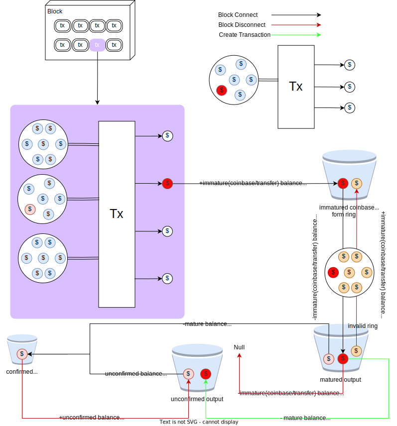

- When receiving a block-connect notification, fetch the block, and do the following process for each transaction:
  - traverse all the outputs. 
  If a TXO belongs to the wallet (depending on the TXO and the wallet's addresses and keys), 
  then put the TXO into either immature coinbase TXO bucket or the immature transfer TXO bucket.
    - generate `block output` records **(TODO: name the database/structure explicitly)** for quick rollback
    - update immature balance and total balance
  - deal with all inputs. Identify the consumed TXOs and move the corresponding TXO from matured TXO bucket/unconfirmed TXO bucket into confirmed TXO bucket.
    - generate `block input` records for quick rollback
    - update mature balance, unconfirmed balance and total balance
    - update UTXORing
  - process maturity.
    - move the new mature coinbase/transfer TXO to the mature bucket, and update the immature coinbase/transfer balance and mature balance.
  - check whether the current height is a special height, and if so, generate new UTXORings.
    - update and record `RingDetail` and `UTXORing` for relevant transaction output
    - update immature transfer balances, mature balances
  - storing block and balance
- When receiving a block-disconnect notification, do the following process:
  - check whether the current height is a special height, and if so, pull out the `blockoutput` of the three blocks that generate the ring.
    - for the corresponding things in mature/unconfirmed/confirmed transaction output, modify their RingHash to zero, and move to immatured transfer output respectively
    - for the only modified utxo.RingHash in immatured coinbase, put it back to immature coinbase output
    - update immature/mature/unconfirm/total balance
    - delete Ring and UTXORing
  - fetch the block output record, and delete them from immature trasfer/coinbase output, meanwhile update immature/total balance
  - fetch the block input record, update/delete UTXORing, and compare new and old UTXORing
    - put the corresponding UTXO of the serial number back into the mature output, then update mature/total balance
  - change the coinbase of the corresponding block to immature coinbase, and update the frozen(**??**)/spendable balance

## 3.5 Query wallet information

To support querying wallet information, the wallet provides external service through RPC Server, the default port is 8667.

All services are provided by registering the command name and the corresponding handler in package `abewallet.rpc.legacyrpc`.

| Name                   | Paramters               | Description                                                  |
| ---------------------- | ----------------------- | ------------------------------------------------------------ |
| getbalancesabe         | null                    | get the balance information of wallet by directly querying the database |
| getbestblockhash       | null                    | get the best synced block hash information by directly querying the database |
| help                   | null                    | print the help information                                   |
| listallutxoabe         | null                    | print all txos which belong wallet by directly querying some sub-bucket in database |
| listunmaturedabe       | null                    | print all immature txos which belong wallet by directly querying the sub-bucket in database |
| listunspentabe         | null                    | print all mature txos which belong wallet by directly querying the sub-bucket in database |
| listspendbutunminedabe | null                    | print all unconfirmed txos which belong wallet by directly querying the sub-bucket in database |
| listspentandminedabe   | null                    | print all confirmed txos which belong wallet by directly querying the sub-bucket in database |
| generateaddressabe     | null                    | derive a new address by derived seed and index number which increase by 1 after completion |


## 3.6 Transfer Transaction Create

Wallet maintains the wallet-related transactions, including those generated coins to wallet and those consumed wallet's coins.
According to the status, the transactions are divided into three categories:
- unconfirmed transactions
- confirmed transactions
- invalid transactions

Inquiry transactions will be supported later.

The transaction status flow is described below as shown in the following figure, from the perspectives of the following three events

- When creating a transaction, 
- When receiving a block-connect notification,
- When receiving a block-disconnect notification,

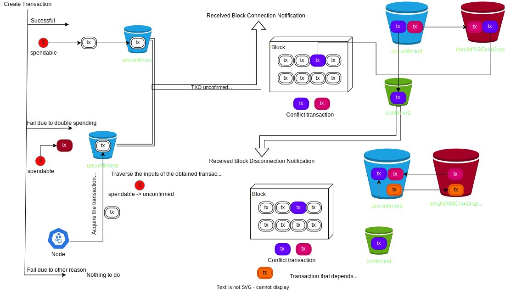

The logic of managing transaction:

- When creating a transaction, if the operation is successful, then record it as unconfirmed. 
  Otherwise, if the transaction is rejected due to double-spending, then query and fetch the conflicted transaction from the ABEC node and store it locally in unconfirmed status.
- When receiving a block connection notification, fetch the block, and perform the following procedure for each transaction in the block:
  - check whether the transaction is in `unconfirmed transaction bucket` or `invalid transaction` bucket
    - If yes, move the corresponding transaction to `conformed transaction bucket`, and move all conflict transactions to `invalid transaction bucket`
    - **todo**: is it possible that there is no such a transaction or in `confirmed transaction bucket`, but the transaction is related to the wallet's coins?
  - check UTXORings in wallet. If a  and update UTXORing if the it is related to wallet, and execute following processes
    - [TXO] compare UTXORing's wallet-related SerialNumbers and the Serial Numbers consumed in the transaction, indicating that the TXO in the wallet is related. Then change the corresponding TXO status to confirmed
    - [Tx] if there is no record of trading Tx in the wallet, put it in the wallet and record the status as confirmed. If the transaction Tx is in the wallet, regardless of whether the status is uncofirmed or invalid, modify their status to confirmed.
    - [Relevant Txs] the Unconfirmed Transactions mapped to according to the relevant TXO above. Indicates that the transaction is dependent on the TXO and changes its status to invalid
- When receiving a block disconnection notification,
  - check UTXORing, if it is related to wallet, roll back UTXORing, and execute following processes
    - [TXO Inputs] compare UTXORing's wallet-related SerialNumbers and the Serial Numbers consumed in the transaction, indicating that the TXO in the wallet is related. Then change the corresponding TXO status to unconfirmed
    - [Tx] the Tx record with transaction status of confirmed is modified to status unconfirmed
    - [Relevant Txs] the Invalid Transactions mapped to according to the relevant TXO above. Check whether the relevant UTXORing is valid, indicating that it is a transaction that depends on the TXO, and change its status to unconfirmed
    - [TXO Outputs] TXO in the block will become immature or deleted, and the relevant UTXORing will be updated. Transactions that reference these UTXORing's unconfirmed become invalid.

## 3.7 Restore Wallet

A user can restore his wallet through the crypto version and mnemonic words saved when generating the wallet. 
The process is basically the same as creating a new wallet, except choosing to `have seed` to restore the wallet.
Note that the user is required to input the **max index number** of recovery addresses.

The wallet initializes the database, converts the mnemonic words to the seed, 
and complete the process of seed derivation, 
and initialize index at the same time and generates addresses based on the maximum number of addresses entered, 
and the genesis block will be scanned.**todo**: genesis block is hardcoded in wallet?


# 4. Package and its dependence
**todo**

An overview of package dependencies is shown in the following figure:


## Abewallet

Responsible for parsing configuration files, creating new wallets or loading existing wallets, opening HTTP services, etc.

- Supported APIs

  | Name                   | Paramters                         | Description                                                  |
  | ---------------------- | --------------------------------- | ------------------------------------------------------------ |
  | getbalancesabe         | null                              | get the balance information of wallet                        |
  | getbestblockhash       | null                              | get the best synced block hash information                   |
  | help                   | null                              | print the help information                                   |
  | listallutxoabe         | null                              | print all txos which belong wallet                           |
  | listunmaturedabe       | null                              | print all immature txos which belong wallet                  |
  | listunspentabe         | null                              | print all mature txos which belong wallet                    |
  | listspendbutunminedabe | null                              | print all unconfirmed txos which belong wallet               |
  | listspentandminedabe   | null                              | print all confirmed txos which belong wallet                 |
  | sendtoaddressesabe     | [<br />address<br />amount<br />] | create a transction with assigned pairs of address and amount |
  | generateaddressabe     | null                              | derive a new address                                         |
  | walletpassphrase       | passphrase<br />timeout           | keep the wallet unlocked for a specified time                |

### chain

Multi-type node support is provided through the interface, which is responsible for the interface requirements for the interaction between the client and the whole node. Currently, only "abec" (the Golang implementation of abelian) is supported as a backend.

There are mainly two ways of interaction, one is in the form of function calls, and the other is asynchronous notification.

- Function calls include: getting data and sending transactions
- Asynchronous notifications include successful client connection, block connection to the main chain (block connection notification), and block separation from the main chain (block disconnection notification)

```go
type Interface interface {
   Start() error
   Stop()
   WaitForShutdown()
   GetBestBlock() (*chainhash.Hash, int32, error)               // request the best block height and hash
   GetBlockAbe(hash *chainhash.Hash) (*wire.MsgBlockAbe, error) // request the origin block by given hash
   GetBlockHash(int64) (*chainhash.Hash, error)                 //request the hash given height
   GetBlockHeader(*chainhash.Hash) (*wire.BlockHeader, error)   // request the block height given hash
   IsCurrent() bool
   BlockStamp() (*waddrmgr.BlockStamp, error)
   SendRawTransactionAbe(*wire.MsgTxAbe, bool) (*chainhash.Hash, error)
   RescanAbe(*chainhash.Hash) error
   NotifyBlocks() error
   Notifications() <-chan interface{} // receive the notification from block chain
   BackEnd() string
}
```

### cmd

Wallet-related tools, such as knowing part of the data, will be supported later.

### internal

##### cfgutil

Provide related auxiliary functions for parsing and loading configuration files, such as strings, currency conversion, check files, address translation, and so on.

##### prompt

Encapsulation function to receive user input in a secure manner

##### rpchelp

generate help information for Remote Process Call

##### zero

Force some private information to be emptied instead of waiting for GC to reclaim

### nat

Use UPnP to provide NAT function [will be integrated later]

### netparams

Set network parameters, including current network parameters, RPC server port, RPC client port

### rpc

Provide services through gRPC agreement [will be supported later]

### snacl

Provide key derivation function, use secretbox to implement encryption and decryption through XSalsa20 and Poly1305, use scrypt to provide key derivation function, and use secretbox to implement encryption and decryption through XSalsa20 and Poly1305.

### waddrmgr

Manage the address with the help of the database, provide the function of address derivation, and maintain the state of address derivation.

- Key management

  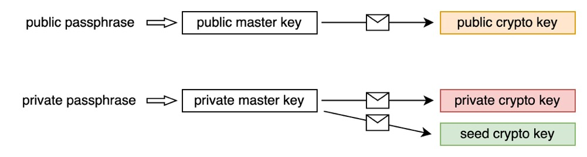

- Address derivation and Derivation Status

  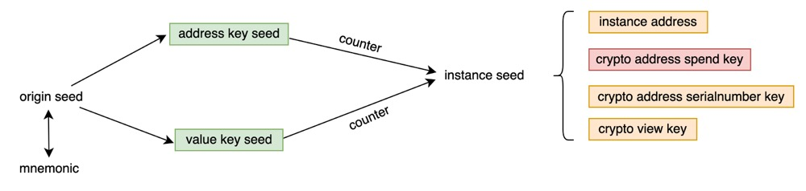

- Address management

  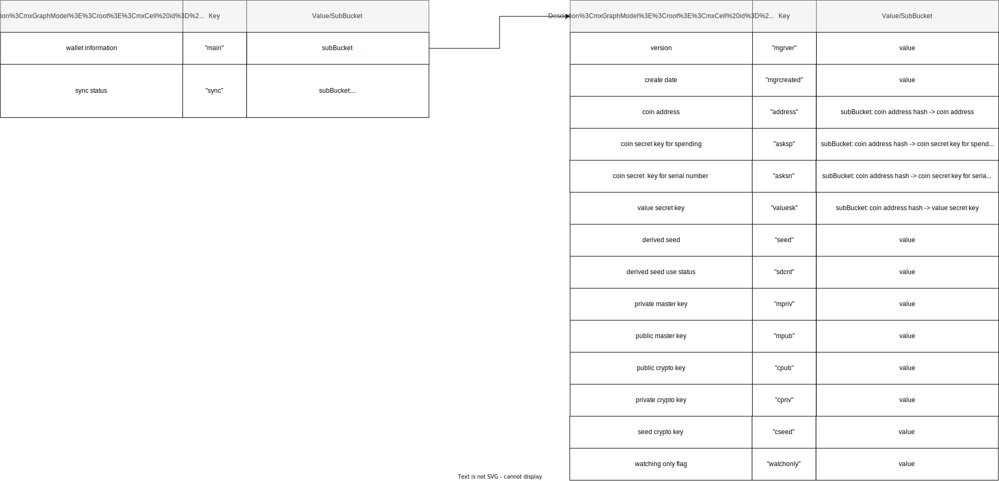


### wallet

The core module of abewallet. In this module, using a loader for responsibility to create open wallets and providing some callback methods to automatically call these when the wallet is opened. 

The txCreator is launched as a goroutine to receive instructions to create a deal.

The walletLocker is launched as a goroutine to receive instructions to unlock the wallet.

### walletdb

Database interface definition and implementation, using boltDB to manage wallet database, mainly includes the following parts:

- Provide creation and deletion of bucket
- Provide read and write transactions
- Provide traversal iterator of bucket
- Define and implement DB interface
- Provide DB registration

### wordlists

Quote BIP-0039 's mnemonic list as a wallet mnemonic list

### wtxmgr

Walletdb provides storage capabilities for wallet tracking UTXO-related data, including, but not limited to, Raw UTXO data and auxiliary data, as well as automated processes for data management.

The database storage design is as follows：

- Data and state management storage:
  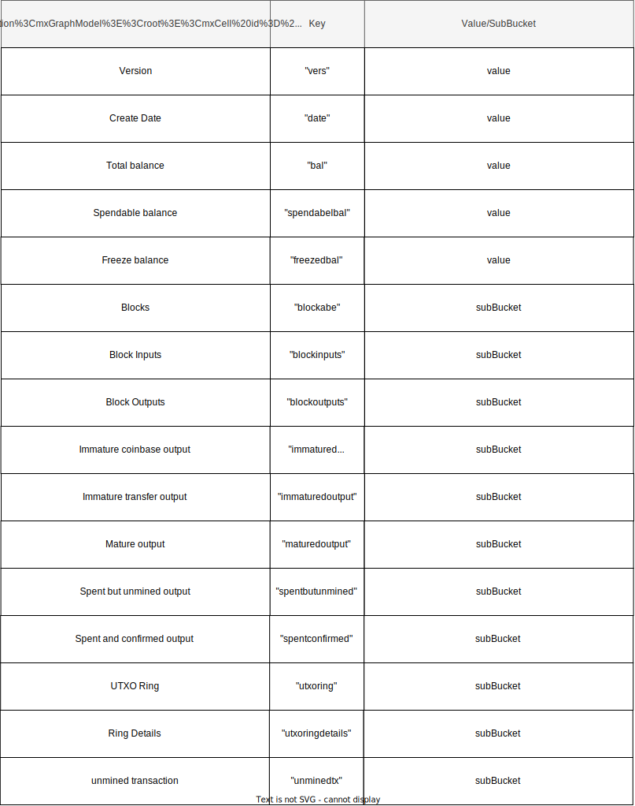


